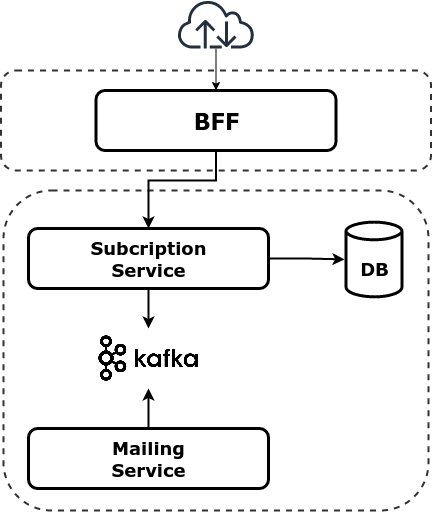

# Subcription System Example

## Architecture Diagram

### bff-gateway
Backend For Frontend microservice to be used by UI frontend.

Routing to internal services is performed using Open Feign library.

##### Endpoints (Accessible from external network):
* _Create Subcription:_ `POST http://localhost:8080/api/subcriptions`
* _Cancel Subcription:_ `DELETE http://localhost:8080/api/subcriptions/{id}`
* _Get Subcription:_ `GET http://localhost:8080/api/subcriptions/{id}`
* _Get all subcriptions:_ `GET http://localhost:8080/api/subcriptions`

##### Swagger (Accessible from external network):
* _Swagger-UI:_ `http://localhost:8080/swagger-ui.html`
* _Swagger Api Docs:_ `http://localhost:8080/v2/api-docs`

### subcription-service
Subcription service, exposing Create, Read and Delete REST endpoints.

This service is designed using Hexagonal-Architecture and Maven modules:
* _app:_ Module to build application containing all modules together.
* _core:_ Domain module implementing subcription logic.
* _db-repository:_ Adapter to store subcriptions in database.
* _rest-api:_ Adapter to expose REST endpoints
* _notification-adapter:_ Adapter to send notifications using Kafka broker.

##### Endpoints (Accessible from internal network):
* _Create Subcription:_ `POST http://localhost:8081/api/subcriptions`
* _Cancel Subcription:_ `DELETE http://localhost:8081/api/subcriptions/{id}`
* _Get Subcription:_ `GET http://localhost:8081/api/subcriptions/{id}`
* _Get all subcriptions:_ `GET http://localhost:8081/api/subcriptions`

##### Swagger (Accessible from internal network):
* _Swagger-UI:_ `http://localhost:8081/swagger-ui.html`
* _Swagger Api Docs:_ `http://localhost:8081/v2/api-docs`

### mailing-service
Mailing service reading events from Kafka broker. This service is a mock reading events and printing them in a log.

## Requirements

* Maven
* Java 11
* Docker & Docker-Compose

## Build

If you want to build and start the system using docker, run:

	./startup.sh

To stop the system:

	./shutdown.sh

In order to develop, you can start a Kafka broker using this command:

	docker-compose -f zk-single-kafka-single.yml up

And to stop it: 

	docker-compose -f zk-single-kafka-single.yml down

## Next steps

* Implement Zero-Trust Security approach, authenticating services using an Identity Provider in order to authenticate internal resources.
* Introduce Spring Cloud Netflix stack to provide Service Discovery, Circuit Breaking, routing and load balacing.
* Implement a CI/CD pipeline.
* Deploy in Kubernetes. 