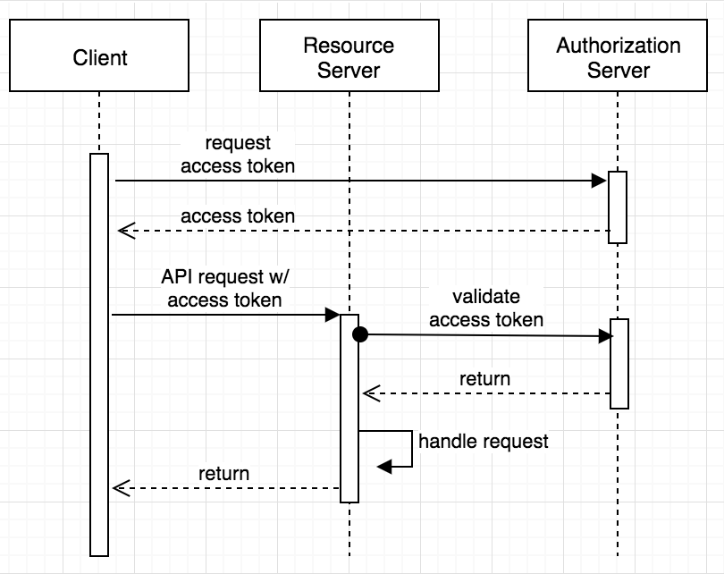

# Subcription System Example

## Architecture Diagram

### bff-gateway
Backend For Frontend microservice to be used by UI frontend.

Routing to internal services is performed using **Open Feign** library.

##### Endpoints (Accessible from external network):
* _Create Subcription:_ `POST http://localhost:8080/api/subcriptions`
* _Cancel Subcription:_ `DELETE http://localhost:8080/api/subcriptions/{id}`
* _Get Subcription:_ `GET http://localhost:8080/api/subcriptions/{id}`
* _Get all subcriptions:_ `GET http://localhost:8080/api/subcriptions`

##### Swagger (Accessible from external network):
* _Swagger-UI:_ `http://localhost:8080/swagger-ui.html`
* _Swagger Api Docs:_ `http://localhost:8080/v2/api-docs`

### subcription-service
Subcription service, exposing Create, Read and Delete REST endpoints.

This service is designed using **Hexagonal-Architecture** and Maven modules:
* _app:_ Module to build application containing all modules together.
* _core:_ Domain module implementing subcription logic.
* _db-repository:_ Adapter to store subcriptions in database.
* _rest-api:_ Adapter to expose REST endpoints
* _notification-adapter:_ Adapter to send notifications using Kafka broker.

##### Endpoints (Accessible from internal network):
* _Create Subcription:_ `POST http://localhost:8081/api/subcriptions`
* _Cancel Subcription:_ `DELETE http://localhost:8081/api/subcriptions/{id}`
* _Get Subcription:_ `GET http://localhost:8081/api/subcriptions/{id}`
* _Get all subcriptions:_ `GET http://localhost:8081/api/subcriptions`

##### Swagger (Accessible from internal network):
* _Swagger-UI:_ `http://localhost:8081/swagger-ui.html`
* _Swagger Api Docs:_ `http://localhost:8081/v2/api-docs`

### mailing-service
Mailing service reading events from **Kafka broker**. This service is a mock reading events and printing them in a log.

## Security - Oauth2 Authentication 

I've implemented **Zero Trust Security** approach authenticating internal services using an Okta Oauth2 Identity Provider in order to authenticate internal resources.

BFF Gateway service is authenticated using **client_credentials** flow and subcription_service **scope**, following this guide: [Secure Server-to-Server Communication with Spring Boot and OAuth 2.0 ](https://developer.okta.com/blog/2018/04/02/client-creds-with-spring-boot)

¡IMPORTANT!
> In order to test it, you have to configure OAuth2 properties in BFF Gateway and Subcription Service with your own Okta properties. To make it work in docker, put credentials in the .env file.

## Requirements

* Maven
* Java 11
* Docker & Docker-Compose

## Build

If you want to build and start the system using docker, run:

	./startup.sh

To stop the system:

	./shutdown.sh

In order to develop, you can start a Kafka broker using this command:

	docker-compose -f zk-single-kafka-single.yml up

And to stop it: 

	docker-compose -f zk-single-kafka-single.yml down

## HTTP REQUESTS Examples

Create a subcription:

	POST /api/subcriptions HTTP/1.1
	Host: localhost:8080
	Content-Type: application/json

	{
		"email": "example@example.org",
		"firstName": "Example",
		"gender": "MALE",
		"birthdate": "2018-10-19",
		"consent": true,
		"newsletterId": 1
	}

Get a subcription:

	GET /api/subcriptions/1 HTTP/1.1
	Host: localhost:8080
	Content-Type: application/json

Get all subcriptions:

	GET /api/subcriptions HTTP/1.1
	Host: localhost:8080
	Content-Type: application/json

Remove an existing subcription

	DELETE /api/subcriptions/1 HTTP/1.1
	Host: localhost:8080
	Content-Type: application/json

## Next steps

* Introduce Spring Cloud Netflix stack to provide Service Discovery, Circuit Breaking, routing and load balacing.
* Implement a CI/CD pipeline.
* Deploy in Kubernetes. 
